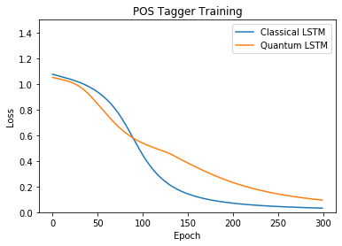

# Example of a Quantum LSTM 

Get the code:
```
git clone https://github.com/rdisipio/qlstm.git
cd qlstm
```

Create a Python 3.x virtual environment and install libraries:
```
python3 -m venv qml
source qml/bin/activate
pip3 install --upgrade pip
pip3 install -r requirements.txt
```

Test if it works with the classical LSTM from PyTorch:
```
$ ./example_pos.py -E 8 -H 4 -Q 0 -e 300
```

If everything works, you should see a training history like this:

